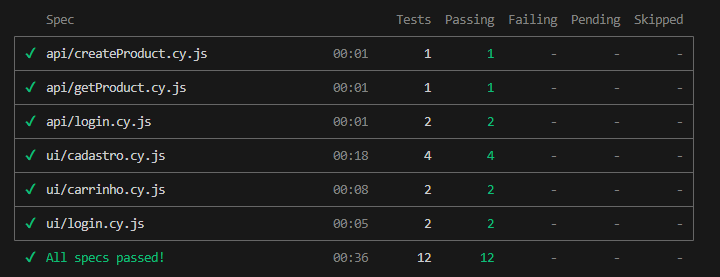

# Projeto de Automação de Testes — ServeRest


Suite de testes automatizados E2E e de API para a aplicação [ServeRest](https://serverest.dev/), desenvolvida com Cypress e JavaScript. O objetivo é garantir a qualidade da aplicação validando tanto a interface gráfica quanto os fluxos de backend, simulando ações reais de usuários.

> Os testes rodam diretamente contra o ambiente público do ServeRest (`https://front.serverest.dev` / `https://serverest.dev`). Nenhuma configuração local da aplicação é necessária.

---

## 1. Arquitetura e Padrões Adotados

- **Page Object Model (POM)**: Interações de UI e seletores isolados em classes dedicadas (`LoginPage`, `RegisterPage`, `ProductsPage`) com Fluent Interface para encadeamento de chamadas.
- **API First Pattern**: Preparação de dados em testes de frontend realizada via chamadas de API no `before()`, eliminando dependências de UI preexistentes e reduzindo fragilidade.
- **Custom Commands Modulares**: Comandos personalizados segregados por domínio semântico (`auth`, `products`, `users`) em vez de um `commands.js` monolítico.
- **Dados Dinâmicos com Ciclo de Vida**: Geração de identificadores únicos via `Date.now()` e limpeza de dados nos hooks `before`/`after`, garantindo isolamento e idempotência entre execuções.
- **Seletores Estáveis**: Uso exclusivo de atributos `data-testid` para minimizar quebras causadas por mudanças de layout ou estilização do DOM.
- **Centralização de Ambientes**: URLs de API e UI configuradas via `Cypress.env` no `cypress.config.js`, sem hardcode nos arquivos de teste.

---

## 2. Decisões Técnicas

**Por que API First Pattern no setup dos testes de UI?**
Criar dados via UI é lento, frágil e acopla specs independentes entre si. Usar chamadas de API no `before()` mantém cada teste responsável apenas pelo comportamento que está validando, sem depender de fluxos que são cobertos por outras specs.

**Por que `Date.now()` para e-mails únicos?**
O ServeRest é um ambiente público compartilhado. Sem unicidade garantida nos dados de teste, execuções paralelas ou consecutivas colidiriam em cadastros duplicados. `Date.now()` oferece unicidade suficiente para um ambiente de testes sem adicionar dependências externas como UUID.

**Por que tokens são renovados no `after()` em vez de reutilizados do `before()`?**
Tokens do ServeRest têm tempo de expiração. Reutilizar o token capturado no `before()` no `after()` é um risco real em suites mais longas. Re-autenticar no `after()` garante que o cleanup nunca falhe por token expirado.

**Por que Cypress em vez de Playwright ou Selenium?**
Cypress oferece execução nativa no browser, API de encadeamento assíncrono sem `async/await` explícito, e acesso direto a `cy.request()` para orquestração API+UI na mesma suite — o que simplifica significativamente o padrão API First adotado.

---

## 3. Cobertura de Testes

| Suite | Cenário | Tipo |
|---|---|---|
| API - Login | Credenciais inválidas retornam 401 | API |
| API - Login | Login com credenciais válidas retorna token | API |
| API - Create Product | Criação de produto retorna 201 e ID | API |
| API - GET Product | Listagem retorna estrutura válida e produto criado | API |
| UI - Login | Exibição de erro para credenciais inválidas | E2E |
| UI - Login | Login com sucesso redireciona ao home | E2E |
| UI - Register | Validação de campo nome obrigatório | E2E |
| UI - Register | Validação de campo email obrigatório | E2E |
| UI - Register | Validação de campo password obrigatório | E2E |
| UI - Register | Cadastro de administrador com verificação via API | E2E |
| UI - Cart | Adição de produto ao carrinho | E2E |
| UI - Cart | Limpeza do carrinho | E2E |



---

## 4. Pré-Requisitos

- Node.js 18.x ou LTS
- NPM
- Git

---

## 5. Instalação

1. Clone o repositório:
```bash
git clone https://github.com/techlucas-lucas/projeto-teste-automatizado.git
```

2. Acesse a pasta do projeto:
```bash
cd projeto-teste-automatizado
```

3. Instale as dependências:
```bash
npm install
```

> Em pipelines de CI, utilize `npm ci` para instalação limpa e determinística a partir do `package-lock.json`.

---

## 6. Estrutura do Projeto

```
├── .github/
│   └── workflows/
│       └── ci.yml              # Pipeline de CI via GitHub Actions
├── docs/
│   └── cypress-run.png         # Screenshot da suite em execução
├── cypress/
│   ├── commands/               # Custom Commands modulares por domínio (auth, products, users)
│   ├── e2e/
│   │   ├── api/                # Testes de contrato e validação de endpoints REST
│   │   └── ui/                 # Testes E2E de interface com Page Objects
│   ├── fixtures/               # Massa de dados estática (JSON)
│   └── support/
│       ├── pages/              # Page Objects com locators, ações e asserções de UI
│       ├── commands.js         # Importador central dos Custom Commands
│       └── e2e.js              # Entry point do support, carregado antes de cada spec
├── .eslintrc.json              # Configuração do ESLint com plugin cypress/recommended
├── cypress.config.js           # Configuração base: baseUrl, envs, retries, timeouts
├── package.json                # Dependências e scripts NPM
└── README.md
```

---

## 7. Como Executar os Testes

Abrir a interface visual interativa:
```bash
npm run cy:open
```

Executar toda a suite em modo headless:
```bash
npm run cy:run
```

Executar somente os testes de API:
```bash
npm run cy:run:api
```

Executar somente os testes de UI:
```bash
npm run cy:run:ui
```

Verificar qualidade de código com ESLint:
```bash
npm run lint
```

---

## 8. Integração Contínua

O projeto utiliza **GitHub Actions** com pipeline definido em `.github/workflows/ci.yml`.

O pipeline é acionado automaticamente em todo `push` ou `pull request` nas branches `master` e `main`, executando as seguintes etapas:

1. Checkout do repositório
2. Configuração do Node.js 18
3. Instalação das dependências via `npm ci`
4. Execução dos testes de API
5. Execução dos testes de UI
6. Upload automático de screenshots como artefato em caso de falha

As configurações de `retries: 2` em `runMode` e `screenshotOnRunFailure: true` presentes no `cypress.config.js` complementam a robustez da execução em CI.

---

## Autor

Lucas Gabriel Lopes Figueiró — [lucas@techlucas.com.br](mailto:lucas@techlucas.com.br)
